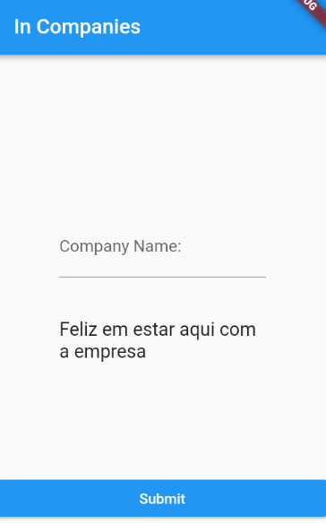

# poc_meetup

## Descrição/Description
Um projeto de teste e desenvolvimento de funcionalidade ValueNotifier e setState específico para participação de um meetup. Inicialmente o projeto teve esse propósito, porém estou implementando outras funcionalidades a fim de acompanhar meu progresso no desenvolvimento com Flutter. 
A test project and functionality developemnt.

    

## Desenvolvimento/Development
- [x] Reatividade ao lidar com textos

## Aprendizado
- ValueNotifier
- Uso do setState
- Uso do RxNotifier
- Aprendizado de reatividade no Flutter usando ValueNotifier e usando setState.
- Uso do Triple, polimosfismo e store

 

## Próximos Passos
- Refatoração do código
- validação de campos do formulário

- [Lab: Write your first Flutter app](https://flutter.dev/docs/get-started/codelab)
- [Cookbook: Useful Flutter samples](https://flutter.dev/docs/cookbook)

For help getting started with Flutter, view our
[online documentation](https://flutter.dev/docs), which offers tutorials,
samples, guidance on mobile development, and a full API reference.